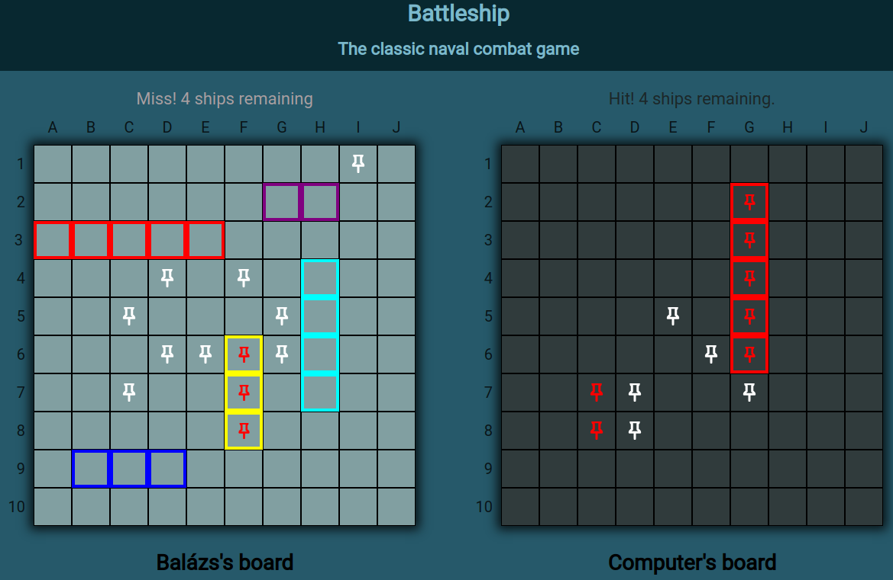
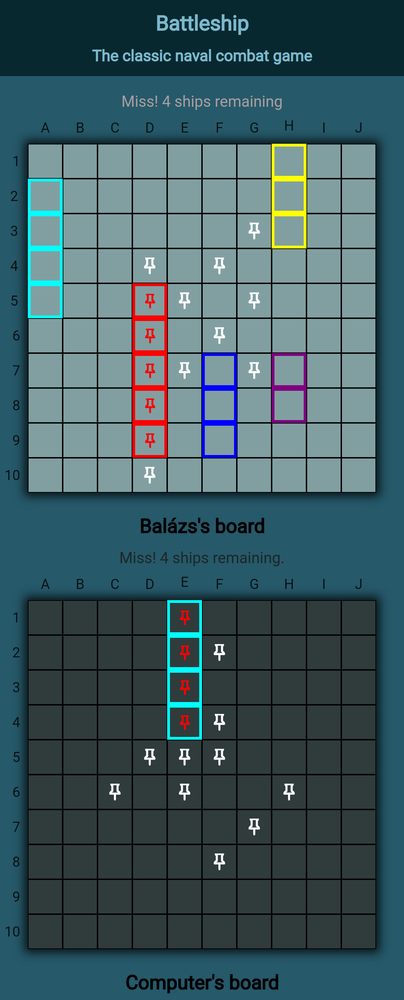

# The Odin Project - Battleship

This is a solution to the [The Odin Project Battleship project](https://www.theodinproject.com/lessons/node-path-javascript-battleship). The task is to implement the classic game: 'Battleship'.

The Odin Project challenges help you improve your coding skills by building realistic projects.

## Table of contents

- [Overview](#overview)
  - [Screenshot](#screenshot)
  - [Links](#links)
- [My process](#my-process)
  - [Built with](#built-with)
  - [Continued development](#continued-development)
  - [Useful resources](#useful-resources)
- [Author](#author)
- [Acknowledgments](#acknowledgments)

## Overview

### Screenshot

### Links

- Solution URL: [Github repository](https://github.com/BalazsBanfi/Battleship)
- Live Site URL: [Github page](https://balazsbanfi.github.io/Battleship)

## My process

- In my childhood we played the game according to the rule that the ships couldn't be next to each other. I know the official rules about the placement of ships, but I implemented the game based on my previous experience.
- I put the most energy into the gameplay and computer intelligence. I'll have to develop the look and should to add some functions later (allows players to place their ships, 2 player options, etc..)

- About the intelligence of the computer:
  - It first tries to hit the middle of the board, where the chances of ships appearing are higher
  - After it extends the shots to the entire board
  - It only tries to hit every second cell, since ships cannot be neighbors and even the smallest ship occupies two cells
  - If it hits a ship, it will try to sink it

### Built with

- JavaScrip
- Multidimensional array for the cell id-s
- Git branches, git merge
- Webpack
- Test Driven Develope (jest)
- Modules, Grid, CSS pseudo, change attributes and style with JavaScript

### Continued development

I would like to be comfortable with JavaScript, responsive web design techniques, css grid, flexbox and want to perfect mobile-first method.

### Useful resources

- [The Odin Project](https://www.theodinproject.com/dashboard/) - High quality coding education maintained by an open source community.

- [Homepage of Kevin Powell](https://www.kevinpowell.co/) - Kevin helps a lot working with responsive techniques. I really liked his teaching style and will follow him in the future also.

## Author

- Website - [Bánfi Balázs](https://github.com/BalazsBanfi)
- Frontend Mentor - [@bally4h](https://www.frontendmentor.io/profile/bally4h)
- Linkedin - [@banfibalazs](https://www.linkedin.com/in/banfibalazs/)

## Acknowledgments

Thanks for the help CS50, The Odin Project, freecodecamp.org, Web Dev Simplified, Kevin Powell, Frontend Mentor and many more..
